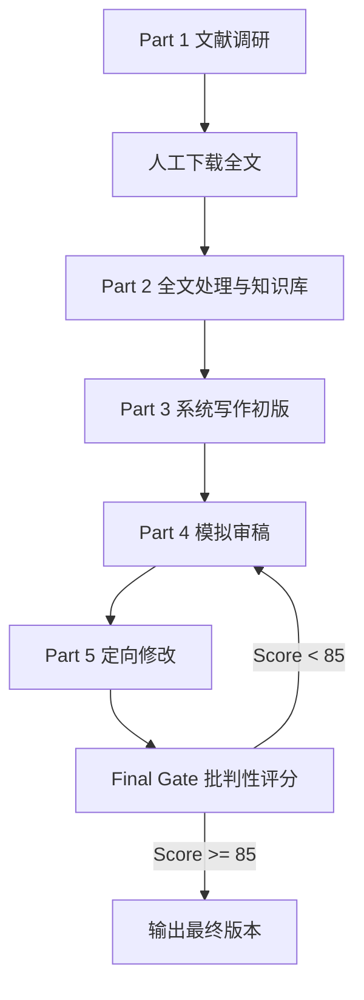

# 综述 Loop 总管线

## 总目标

把综述写作拆成五个 Part，并用一个批判性评分闸门控制最终输出：

## Part 1：文献调研与下载交接

### 目标

使用文献调研类 skill 检索大量相关文献，完成初筛、优先级排序、文献数量闸门检查，并把需要你下载的文献整理成清单。

默认完整综述文献池阈值为 50 篇。如果用户提供的文献少于 50 篇，进入全文处理前必须先询问是否需要更充分检索。如果 specialist literature-search 第一轮保留候选文献少于 50 篇，必须降低一档相关性阈值并进行扩展检索，除非已经记录明确的饱和或范围例外。

### 推荐技能

- `literature-review`
- `literature-search`
- `pubmed-search`
- `paper-lookup`
- 需要更深研究时可用 `deep-research`

### 输入

- `01_scope_protocol.md`
- 关键词组
- 时间范围
- 数据库范围
- 目标综述类型

### 产出

- `part1_literature_search/search_plan.md`
- `part1_literature_search/candidate_literature.csv`
- `part1_literature_search/download_manifest.csv`
- `part1_literature_search/literature_quantity_gate.md`
- `02_search_log.md`

### 人工介入点

你根据 `download_manifest.csv` 下载 PDF、HTML 全文或补充材料，并把本地文件路径填回清单。

### 进入下一阶段标准

- 检索策略和日期已记录。
- 候选文献按优先级排序。
- 文献数量闸门已完成：若少于 50 篇，已询问用户、扩展检索或记录饱和/范围例外。
- 下载清单中核心文献的全文路径已填写。

## Part 2：全文处理与知识库

### 目标

对你下载的文献进行阅读、结构化总结和主题标注，形成可供写作调用的知识库。

### 推荐技能

- `pdf`
- `pdf-processing`
- `markitdown`
- `nature-reader`
- `literature-review`

### 输入

- `part1_literature_search/download_manifest.csv`
- 你下载的 PDF 或全文文件
- `03_screening_matrix.csv`
- `04_evidence_extraction.csv`

### 产出

- `part2_knowledge_base/knowledge_base_index.csv`
- `part2_knowledge_base/paper_notes_template.md`
- 每篇文献的结构化笔记
- `05_theme_synthesis.md`
- `claims_evidence_map.csv`

### 进入下一阶段标准

- 每篇核心文献都有摘要、方法、主要发现、局限和可引用观点。
- 每条核心结论都能追溯到文献。
- 已形成 3 到 6 个主题，而不是论文逐篇罗列。

## Part 3：系统分步骤写作初版

### 目标

利用 Nature 写作类 skill，从知识库出发，按章节写出初版。

### 推荐技能

- `nature-writing`
- `nature-polishing`
- `nature-citation`
- `academic-writing`

### 输入

- `05_theme_synthesis.md`
- `part2_knowledge_base/knowledge_base_index.csv`
- `claims_evidence_map.csv`
- `06_manuscript_draft.md`

### 产出

- `part3_drafting/section_plan.md`
- `part3_drafting/terminology_ledger.csv`
- `part3_drafting/claim_evidence_map.csv`
- 更新后的 `06_manuscript_draft.md`

### 写作原则

- 先写一句话总论点，再写段落。
- 综述按主题、机制、方法或争议组织，不按论文逐篇堆叠。
- 每段只承担一个任务：背景、空白、方法、证据、比较、意义或局限。
- 每个强结论必须有证据支持。
- 对证据不足的地方保留占位符，不编造引用或结论。

### 进入下一阶段标准

- 初版包含标题、摘要、引言、主题章节、挑战、未来方向、结论和参考文献占位。
- 关键术语已统一。
- 核心 claim-evidence map 已完成。

## Part 4：模拟审稿人评价审查

### 目标

用审稿人视角进行批判性评价，找出逻辑、证据、创新性、可读性和投稿风险。

### 推荐技能

- `nature-reviewer`
- `peer-review`
- `scholar-evaluation`

### 输入

- `06_manuscript_draft.md`
- `part3_drafting/claim_evidence_map.csv`
- 目标期刊或目标读者

### 产出

- `part4_mock_review/reviewer_reports.md`
- `part4_mock_review/cross_review_synthesis.md`
- `part4_mock_review/critical_issues.csv`

### 审稿结构

- Reviewer 1：关注新颖性、领域意义和叙事逻辑。
- Reviewer 2：关注证据强度、引用准确性和方法完整性。
- Reviewer 3：关注可读性、跨领域读者和结构清晰度。
- Cross-review synthesis：汇总共识风险和最优先修改项。

### 进入下一阶段标准

- 至少获得 3 份模拟审稿意见。
- 每条 major concern 都已编号。
- 每条意见都能映射到正文中的章节或证据缺口。

## Part 5：根据审稿意见定向修改

### 目标

把审稿意见拆解成可执行任务，逐条修改正文、补充证据、压缩过度结论，并维护修改记录。

### 推荐技能

- `nature-response`
- `nature-polishing`
- `nature-citation`
- `academic-writing`

### 输入

- `part4_mock_review/reviewer_reports.md`
- `part4_mock_review/critical_issues.csv`
- `06_manuscript_draft.md`

### 产出

- `part5_revision/revision_action_tracker.csv`
- `part5_revision/response_to_mock_reviewers.md`
- 更新后的 `06_manuscript_draft.md`
- 更新后的 `07_revision_loop.md`

### 修改原则

- 每条审稿意见必须回应、修改、解释或标记为暂无法解决。
- 修改必须映射到正文位置、图表、引用或明确占位符。
- 不用防御性语言；先承认问题，再说明修改。
- 如果审稿人误解了正文，优先检查是不是正文表达导致误解。

### 进入最终评分标准

- 所有 major concerns 都已处理。
- 所有高风险 claim 都有证据或被降调。
- 引用、术语、图表和段落逻辑已再次核查。

## Final Gate：批判性审稿打分

### 目标

对修改后的版本进行最终批判性评分。总分高于 85 才输出最终版本；低于 85 则回到 Part 4 或 Part 5。

### 评分维度

| 维度 | 权重 |
| --- | --- |
| 研究问题与范围清晰度 | 10 |
| 文献覆盖与检索可复现性 | 15 |
| 主题综合深度 | 15 |
| 证据强度与引用准确性 | 20 |
| 批判性与争议处理 | 10 |
| 结构与叙事逻辑 | 10 |
| Nature 风格可读性与跨领域表达 | 10 |
| 图表、术语和格式完整性 | 5 |
| 局限与未来方向 | 5 |

### 判定

- `>= 90`：强版本，可进入最终润色和格式整理。
- `85-89`：可输出最终版本，但建议记录残余风险。
- `75-84`：不输出最终版本，回到 Part 5 定向修改。
- `< 75`：回到 Part 4 重新模拟审稿，必要时回到 Part 2 补知识库。
